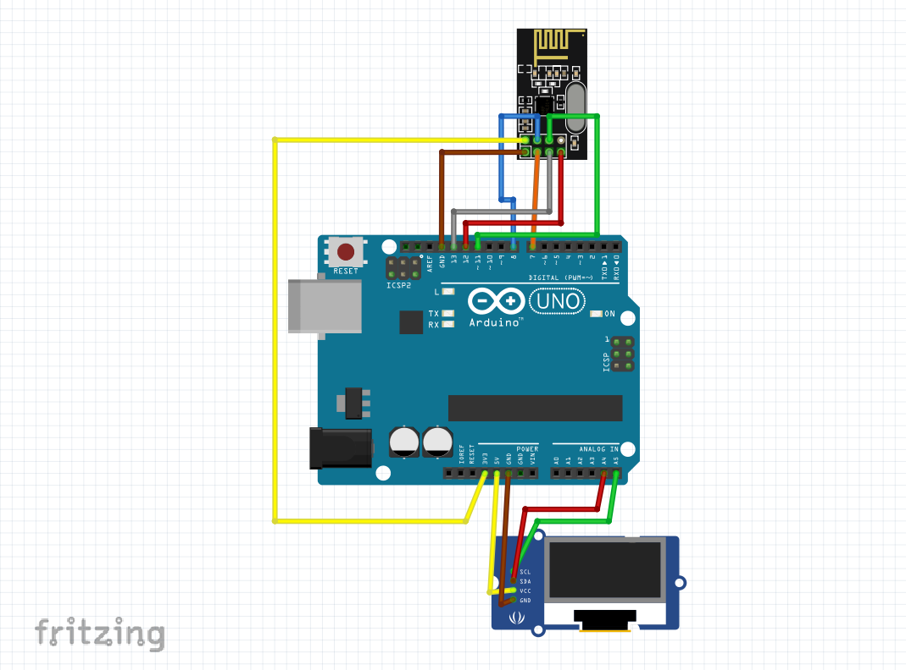

# 🌿 Environment Monitoring & Prediction System

This project integrates **ESP32-based environmental sensor data collection**, **machine learning classification**, and **displaying prediction labels on an LCD via NRF24L01 wireless module**.

## 🚀 Project Overview

- The **ESP32** collects data from DHT11 (temperature & humidity), MQ135 (air quality), and LDR (light intensity) sensors.  
- Sensor data is sent via WiFi to a PHP server.  
- On the Python side, time-series classification using XGBoost is performed based on MySQL database data.  
- Every 10 minutes, the environment state is predicted and sent wirelessly to another device via **NRF24L01**.  
- The receiving Arduino displays the prediction labels on a 20x4 I2C LCD.

---

## 📡 Hardware Components

- ESP32  
- DHT11  
- MQ135  
- LDR  
- NRF24L01 (2 units)  
- Arduino Uno or similar  
- 20x4 I2C LCD display  

---

## 🖼️ Hardware Diagram (Fritzing)

---

## 🛠️ Software Components

### 1. **ESP32 Sensor and Prediction Sender (`esp32_env_predictor_nrf`)**

- Reads temperature, humidity, air quality, and light data from sensors.  
- Sends data to the PHP server via HTTP POST (`data_receiver.php`).  
- Retrieves prediction labels from the server via HTTP GET (`prediction_fetch.php`).  
- Sends the prediction label to the receiver Arduino using NRF24L01.

### 2. **Arduino LCD Receiver (`env_label_receiver_lcd`)**

- Receives prediction labels wirelessly via NRF24L01.  
- Displays the received prediction label on a 20x4 LCD, split into sections.  
- Example prediction: `"dirty-night-normal-normal"` shown as "Condition", "Time", "Temperature", "Humidity" on the LCD.

### 3. **Machine Learning - Python Script (`environment_classifier.py`)**

- Fetches the last 70 minutes of sensor data from MySQL.  
- Labels data (clean/dirty, day/night, hot/normal/cold, humid/dry/normal).  
- Uses XGBoost classifier to predict the environment status 10 minutes ahead.  
- Writes the prediction back to the MySQL database.  
- Scheduled to run every 10 minutes using the `schedule` library.

### 4. **PHP Server Scripts**

- `data_receiver.php`: Receives sensor data from ESP32 and inserts it into the MySQL database.  
- `prediction_fetch.php`: Returns the latest prediction result in JSON format.

---

## 📝 Setup and Requirements

### 📂 Server Files

- Place `data_receiver.php` and `prediction_fetch.php` in the appropriate directory on your server.  
- Update the database connection details as needed.

---

### 🐍 Python Environment

- Python 3.8+  
- Libraries: `pandas`, `mysql-connector-python`, `xgboost`, `scikit-learn`, `schedule`  
- Update database connection settings in `environment_classifier.py`.

---

### 📡 ESP32

- Libraries: `WiFi`, `HTTPClient`, `DHT`, `SPI`, `RF24`  
- Configure WiFi SSID, password, and PHP server address.

---

### 📟 Arduino (LCD Receiver)

- Libraries: `SPI`, `RF24`, `LiquidCrystal_I2C`

---

## ⚙️ Usage

1. Set up the ESP32 with sensors and NRF24L01 module.  
2. Configure the PHP server files and MySQL database.  
3. Run the Python script to enable automatic predictions.  
4. Set up the Arduino device with NRF24L01 and LCD.  
5. ESP32 collects sensor data and sends it to the server, Python makes predictions, and Arduino receives and displays predictions wirelessly.

---

## 📜 License

This project is licensed under the MIT License. See the LICENSE file for more details.

---

This is a hobby and learning project. Feel free to use and improve it. If you like the project, don’t forget to ⭐ star the repository to support it!
